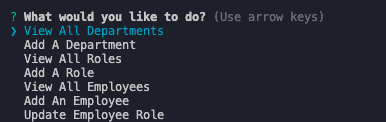
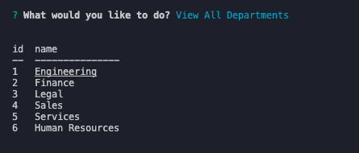
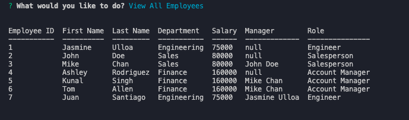
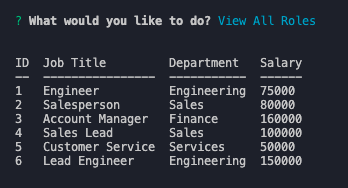
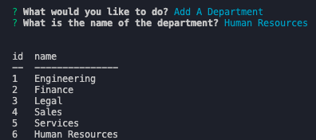

# employee-tracker


## Description
 ```
 AS A business owner
I WANT to be able to view and manage the departments, roles, and employees in my company
SO THAT I can organize and plan my business
 ```
The objective for this assignment was to create a content management system that allows the user to easily viewe and interact with information stored in databases. In this module we are building a command-line application to manage a company's employee database using Node.js, Inquirer, and mySQL.

I was successfully able to view all departments, roles and employees. I was also able to allow the user to add a new department to the database. 

I struggled with getting the newly added roles to populate in the choices array using inquirer. I thought about hard coding all the departments but that would exclude newly added departments and that wouldn't be helpful because what if i wanted to add a new department THEN add a new role IN  the department i just created? Well, the newly created department would not be an option to choose from because the departments list isn't being created dynamically. 

Once i am able to get past this error, I can add a new role and a new employee to that role. Until them, my application ends at adding an role. I was not able to add an employee, role, or update an existing employee because I spend some time trying to get over this error.

I plan on going back and bringing this CMS to completion in the upcoming days.


## Installation

This code requires the installation of the following packages

1. `npm install`
2. `npm i express`
3. `npm i inquirer`
4. `npm i mysql2`
5. `npm i ctable`

Once all of the dependencies are installed run

`node server.js`

You can watch the [walk through video](https://youtu.be/vK5elZTDLpM)

## Usage

After running `node server.js` this user will see this menu




Choose from the choices













## License

MIT License

Copyright (c) [2023] [Jasmine Ulloa]

Permission is hereby granted, free of charge, to any person obtaining a copy
of this software and associated documentation files (the "Software"), to deal
in the Software without restriction, including without limitation the rights
to use, copy, modify, merge, publish, distribute, sublicense, and/or sell
copies of the Software, and to permit persons to whom the Software is
furnished to do so, subject to the following conditions:

The above copyright notice and this permission notice shall be included in all
copies or substantial portions of the Software.

THE SOFTWARE IS PROVIDED "AS IS", WITHOUT WARRANTY OF ANY KIND, EXPRESS OR
IMPLIED, INCLUDING BUT NOT LIMITED TO THE WARRANTIES OF MERCHANTABILITY,
FITNESS FOR A PARTICULAR PURPOSE AND NONINFRINGEMENT. IN NO EVENT SHALL THE
AUTHORS OR COPYRIGHT HOLDERS BE LIABLE FOR ANY CLAIM, DAMAGES OR OTHER
LIABILITY, WHETHER IN AN ACTION OF CONTRACT, TORT OR OTHERWISE, ARISING FROM,
OUT OF OR IN CONNECTION WITH THE SOFTWARE OR THE USE OR OTHER DEALINGS IN THE
SOFTWARE.

## Badges


